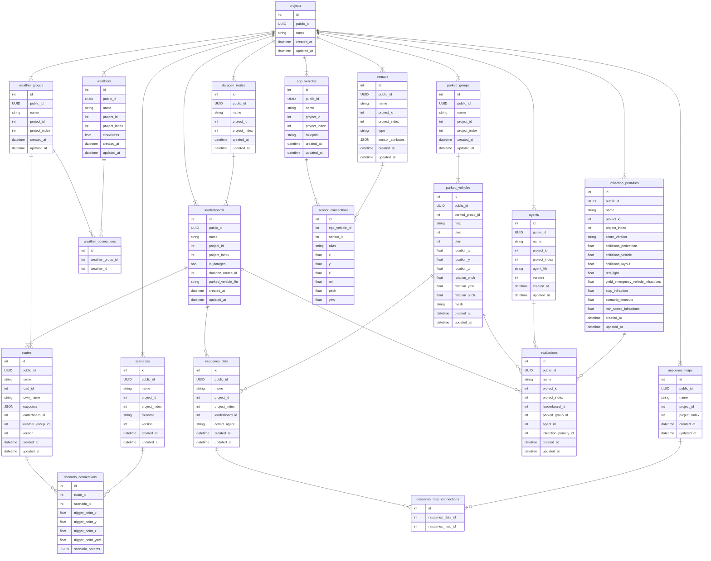

```
data/   # 出力先フォルダのルート（docker_composeでマウントされる）
├── {project_name1}/    # Project1の出力フォルダ
│   ├── {project_name1}.sqlite   # メタデータ管理用のDBファイル
|   ├── map_annotation
|   │   ├── nuscenes/   # nuScenes Map expansion形式の出力フォルダ
|   │   │   ├── basemap_{map_name1}.png  # CARLAから抽出したMap1のベースマップ（png形式）
|   │   │   ├── basemap_{map_name2}.png  # CARLAから抽出したMap2のベースマップ（png形式）
|   │   │   :
|   │   │   └── expansion <- Map Expansionのメタデータ
|   │   └── speed_limits/  # Carla GARAGE用のspeed_limitsファイル
|   │       ├── {map_name1}_speed_limits.npy  # CARLAから抽出したMap1のspeed_limitsファイル（npy形式）
|   │       :
|   ├── data_collection
|   │   ├── garage/           # CARLA Garage形式データセットの出力フォルダ
|   │   ├── garage_nuscenes/  # CARLA Garage nuScenes用データセットの出力フォルダ
|   │   ├── nuscenes/         # nuScenes形式データセットの出力フォルダ
|   │   :   └── {agent_name}_{datagen_route}_{timestamp}/
|   │           ├── results/  # データ収集時のresult.json
|   │           |   ├── {scenario_type}_{route_name}_result.json
|   │           |   :
|   │           ├── v1.0-trainval/
|   │           ├── sweeps/
|   │           └── samples/
│   ├── agents/                     # Leaderboard形式のエージェントコード置き場（デフォルトはleaderboardのものを使用）
│   │   ├── {agent_name1}_{version} # あるエージェントのあるバージョンのファイル保持用フォルダ
│   │   :   ├── Dockerfile_sim       # シミュレーション実行用Dockerfile
│   │       ├── Dockerfile_submit    # Leaderboard提出用Dockerfile
│   │       └── team_code            # このフォルダがコンテナにマウントされる
│   │           ├── {agent_name1}.py # エージェントファイル本体
│   │           :                    # その他の依存ファイル（planner等）
│   ├── parked_vehicles/  # Leaderboard形式の駐車車両定義ファイル置き場（デフォルトはleaderboardのものを使用）
│   │   ├── {parked_vehicle_name1}.py
│   │   :
│   └── scenarios/  # シナリオ定義ファイル置き場（デフォルトはscenario_runnerのものを使用）
│       ├── {scenario_name1}.py
│       :
├── {project_name2}/    # Dataset2の出力フォルダ
```

### メタデータ管理用DBの仕様




### テンプレートファイル

#### データ収集用エージェント

- PDM-Lite: carla_garage/collect_dataset_slurm.pyをベースに

#### planner

- 


## 注意点

- ego_vehicleの種類は`leaderboard/scenarios/route_scenario.py`の`_spawn_ego_vehicle`で"vehicle.lincoln.mkz_2020"にハードコーディングされているため、置換処理が必要（シミュレーション実行用コンテナ内の`route_scenario.py`をreplaceするのが良いか）
